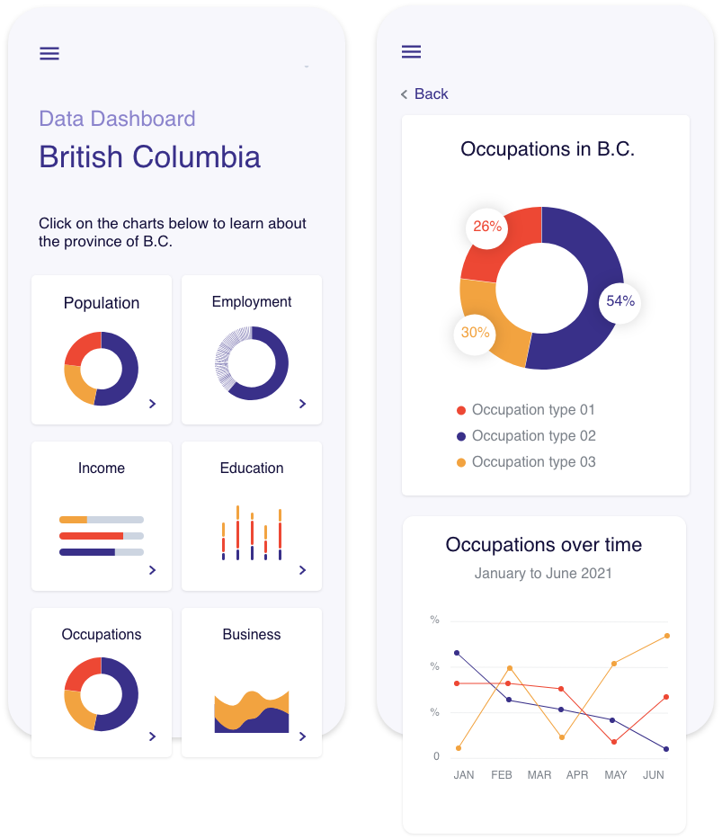
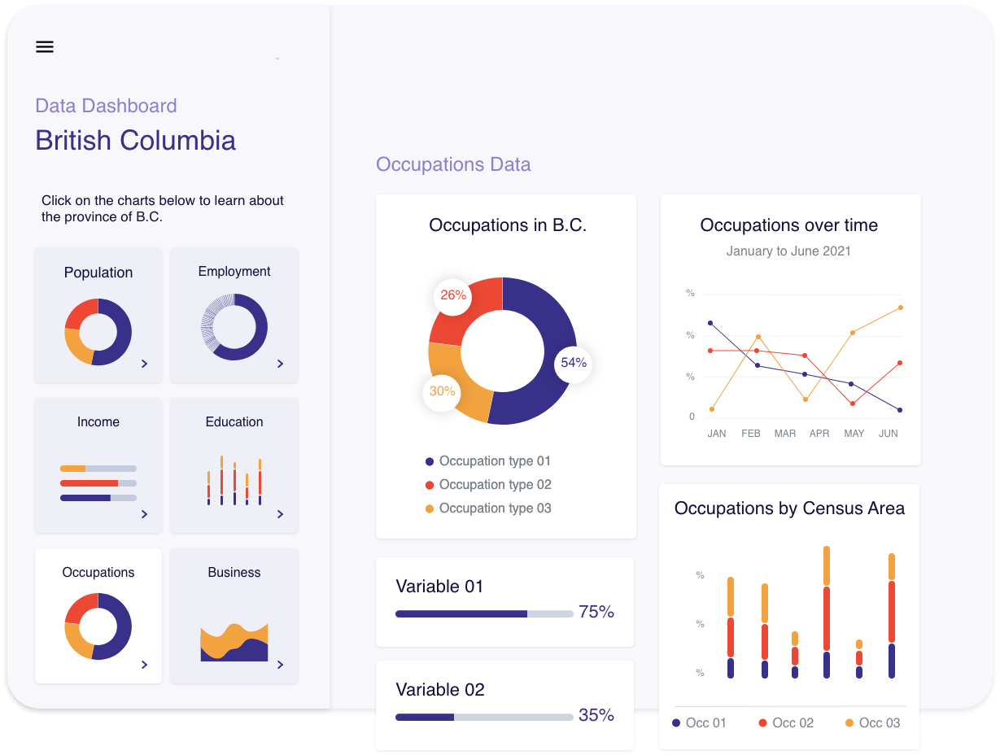

# B.C. Community Information Tool

## An Open Souce Data Pipeline




## Installation

Clone the project.

```
git clone https://github.com/bcgov/CIT
```

Install [Docker](https://docs.docker.com/engine/install/ubuntu/) and [Docker Compose](https://docs.docker.com/compose/install/).

Copy a local config template:

```
cp example.env .env
cp dc.dev.yml docker-compose.override.yml
```

Spin up the project.

```
docker-compose up -d --build
```

Your Vue app is served at `http://localhost`.

The Django app is served at `http://localhost/api`.

Ports may be configured by editing the port in the `dc.*.yml` files.

You can create a new terminal, and run commands to interact with the application. `docker-compose ps` to show services, and `docker-compose exec web bash` to open a shell in inside the django service.

## Importing Data

See [DATA.md](DATA.md)

### MapBox Layer Management

TODO: Document mapbox layers and indicate how data were sourced, and how to update them.

## Development

### VSCode (Front end Development)

If the editor of choice is Visual Studio Code during development, one can have automatic linting enabled

In Files -> Settings -> Workspace -> Open Settings
```
{
  "editor.formatOnSave": true,
  "vetur.validation.template": false,
  "editor.codeActionsOnSave": {
    "source.fixAll.eslint": true
  }
}
```

It is recommended that the Workspace is the `cit-web` folder, and not the `cit` project for this to behave correctly. Otherwise, it won't read the ESLint & Prettier config files properly (VSCode expects them in root workspace by default).

## Deployment

### Updating packages

To update Python packages, update the PyPI package version numbers in `web/requirements.txt`. To update JavaScript packages, update the npm package version numbers in `cit-web/package.json`. Rebuild your containers using `docker-compose build`.

### Environment variables

Create the `.env` file using `example.env` as a template:
```
cp example.env .env
```

Replace all the placeholder values in `.env` with the real values.

### Setting up database users and permissions

In production environments, we create an application user (defaulting to `cit`) instead of using the default `postgres` superuser.

When initializing the database for the first time, run the `init_db.sh` script:
```
docker-compose exec db code/init_db.sh
```

When restoring the database from a sql file, load the file into the `django` database:
```
docker-compose exec db dropdb -U postgres cit
docker-compose exec db createdb -U postgres cit
docker-compose exec db code/init_db.sh
docker cp db.sql "$(docker-compose ps -q db)":/tmp/
docker-compose exec db psql -U postgres -f /tmp/db.sql cit
```


### Setting up REST OAuth tokens for Azure and Power BI

See [AZURE_OAUTH.md](AZURE_OAUTH.md).
